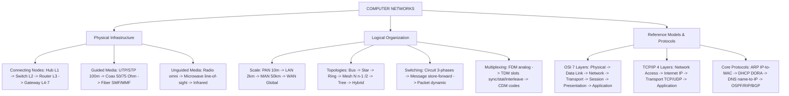

# 06. Module 1 Final Revision: Master Synthesis & Pre-Exam Cram Guide
**Computer Networks — Complete Module 1 Master Revision**  
*Comprehensive synthesis across all 5 syllabus parts*

---

## 1. Complete Module 1 Syllabus Checklist

| Unit | Topic | Priority | Status |
| :--- | :--- | :---: | :---: |
| **1.1 Intro** | Tanenbaum Definition, Autonomous vs. Interconnected, Network Criteria (PRS) | 🔥🔥🔥 | ✅ Ready |
| | Network Classification: PAN ($\le 10\text{m}$), LAN ($<2\text{km}$), MAN ($5-50\text{km}$), WAN (Global) | 🔥🔥🔥 | ✅ Ready |
| | Advantages & Disadvantages of Networking | 🔥🔥 | ✅ Ready |
| **1.2 Topologies**| Bus (Terminators, CSMA/CD, CAN Bus) & Star (Central Switch, School Lab Design) | 🔥🔥🔥 | ✅ Ready |
| | Ring (Token Passing, Dual Ring SONET) & Mesh ($L = \frac{n(n-1)}{2}$, $P = n - 1$) | 🔥🔥🔥 | ✅ Ready |
| | Tree (Hierarchical) & Hybrid Topologies; 12-Parameter Comparison Matrix | 🔥🔥 | ✅ Ready |
| **1.3 Devices** | Hub (Layer 1 broadcast, 1 collision domain) vs. Switch (Layer 2 MAC, micro-segmentation) | 🔥🔥🔥 | ✅ Ready |
| | Router (Layer 3 IP, breaks broadcast domains, NAT) vs. Gateway (L4–7 translator) | 🔥🔥🔥 | ✅ Ready |
| | SBI Smart Branch Design (Router $\rightarrow$ Firewall $\rightarrow$ Core Switch $\rightarrow$ Access Switch; 6-tier VLANs)| 🔥🔥🔥 | ✅ Ready |
| | NIC (48-bit MAC, SerDes, Manchester encoding) & Repeater (attenuation regeneration) | 🔥🔥 | ✅ Ready |
| **1.4 Switching** | Circuit (Dedicated path, 3 phases) vs. Packet Switching (Datagram/Virtual Circuit) | 🔥🔥🔥 | ✅ Ready |
| | Why Internet Uses Packet Switching (Statistical multiplexing, dynamic rerouting) | 🔥🔥🔥 | ✅ Ready |
| **1.5 Multiplexing**| FDM (Analog, guard bands) vs. TDM (Digital time slots: Synchronous, Statistical, Interleaving) | 🔥🔥🔥 | ✅ Ready |
| | Code Division Multiplexing (CDM: Orthogonal Walsh codes) & Numerical Bit Rates | 🔥🔥 | ✅ Ready |
| **1.6 Reference Models**| 7 OSI Layers in sequence, PDUs, delivery scopes (Hop-to-Hop, Host-to-Host, Process-to-Process)| 🔥🔥🔥 | ✅ Ready |
| | Data Encapsulation ($H_7 \dots H_2 + T_2$) & TCP/IP 4-Layer Architecture | 🔥🔥🔥 | ✅ Ready |
| | Master Comparison: OSI Model vs. TCP/IP Model (House Blueprint Analogy) | 🔥🔥🔥 | ✅ Ready |
| **1.7 Media & Tools**| Twisted Pair (UTP vs. STP, Cat6, 100m limit, T568A/B pinouts, Straight vs. Crossover) | 🔥🔥🔥 | ✅ Ready |
| | Fiber Optics (TIR $n_{\text{core}} > n_{\text{cladding}}$, SMF Laser vs. MMF LED) & Coaxial (50Ω vs. 75Ω) | 🔥🔥🔥 | ✅ Ready |
| | Protocols (ARP, DHCP DORA, DNS, OSPF, RIP, BGP) & Security (Firewall, IDS vs. IPS) | 🔥🔥🔥 | ✅ Ready |
| | Network Simulators (Packet Tracer, GNS3, Wireshark packet sniffer) | 🔥🔥 | ✅ Ready |

---

## 2. Master Concept Map

---

## 3. Master Diagram Reference Gallery

### A. Topologies Architecture

### B. Enterprise Network Architecture (SBI Smart Branch)

### C. Switching Techniques Taxonomy

### D. Multiplexing Techniques

### E. OSI 7 Layers & Data Encapsulation

### F. OSI vs. TCP/IP Architecture Mapping

### G. Transmission Media: Twisted Pair & Color Codes

### H. Hardware Devices Comparison Matrix

---

## 4. Master Definitions Cheat-Sheet

1. **Computer Network**: An interconnected collection of autonomous computers capable of exchanging data and sharing resources over a common transmission medium.
2. **Autonomous Computer**: A computer running its own independent CPU and operating system, free from external master-slave control.
3. **Network Topology**: The geometric arrangement of nodes and connecting communication links in a network.
4. **CSMA/CD**: Carrier Sense Multiple Access with Collision Detection; devices listen to the line before sending and abort immediately if a collision occurs.
5. **Micro-Segmentation**: Switch architecture where each individual port is an independent collision domain, eliminating packet collisions in full-duplex mode.
6. **Circuit Switching**: Establishing a dedicated, continuous physical path between sender and receiver through intermediate switches before data transfer begins.
7. **Packet Switching**: Chopping messages into small discrete packets with headers that are dynamically routed across shared intermediate nodes.
8. **Multiplexing**: The simultaneous transmission of multiple independent signals over a single shared physical channel.
9. **Statistical TDM**: Dynamically allocating time slots on-demand only to active channels, eliminating wasteful empty slots.
10. **OSI Reference Model**: A 7-layer theoretical blueprint developed by ISO in 1984 to standardize vendor-independent communications.
11. **Service Access Point (SAP)**: The interface boundary through which an underlying layer provides services to the layer directly above it.
12. **Total Internal Reflection (TIR)**: Optical phenomenon where light reflects 100% back into a core because $n_{\text{core}} > n_{\text{cladding}}$ and incident angle exceeds critical angle.
13. **Intrusion Prevention System (IPS)**: An inline security device that actively inspects live packets and drops malicious traffic in real time.
14. **Address Resolution Protocol (ARP)**: Resolves a known 32-bit IP address into a 48-bit physical MAC address on a local LAN.
15. **DHCP (DORA)**: Dynamic Host Configuration Protocol; automatically leases IP configurations via Discover, Offer, Request, Acknowledge.

---

## 5. Master Comparison Matrices

### Comparison 1: LAN vs. MAN vs. WAN
| Parameter | LAN | MAN | WAN |
| :--- | :--- | :--- | :--- |
| **Geographical Area** | Single room / building ($<2\text{ km}$) | Town or city ($5-50\text{ km}$) | Country or globe ($>50\text{ km}$) |
| **Ownership** | Strictly Private | Public or Consortium | Shared Telecom Carriers / Public |
| **Data Rate** | Very High ($1-10\text{ Gbps}$) | High ($100\text{ Mbps}-1\text{ Gbps}$) | Moderate / Variable |
| **Bit Error Rate** | **Lowest** (cleanest lines) | Moderate | **Highest** (noise over distance) |
| **Example** | College computer lab | City Cable TV broadband | **The Global Internet** |

---

### Comparison 2: The 6 Network Topologies
| Feature | Bus | Star | Ring | Mesh (Full) | Tree | Hybrid |
| :--- | :--- | :--- | :--- | :--- | :--- | :--- |
| **Cable Length** | **Minimum** | Moderate | Moderate | **Maximum** | High | High |
| **Installation Cost**| **Lowest** | Moderate | Moderate | **Exorbitant** | High | High |
| **Scalability** | Poor | **Excellent** | Moderate | Poor (large scale)| **Excellent** | **Excellent** |
| **Fault Tolerance** | **Very Low** | Good | Moderate (Dual=High)| **Maximum** | Good | **Excellent** |
| **Single Failure Point**| **Backbone / Terminator**| **Central Switch**| Cable break | **None** | Root Switch | Design dependent|
| **Real-World Use** | Automotive CAN Bus | Office / Lab LAN | Telecom SONET Ring | Internet Core / ISP| University Campus | Cloud Data Centers |

---

### Comparison 3: Connecting Devices (Hub vs. Switch vs. Router)
| Feature | Active Hub | Network Switch | Router |
| :--- | :--- | :--- | :--- |
| **Operating Layer** | **Layer 1 (Physical)** | **Layer 2 (Data Link)** | **Layer 3 (Network)** |
| **Addressing Used** | None (Blind broadcast) | **MAC Address** | **IP Address** |
| **Forwarding Logic** | Broadcasts to ALL ports | Selective Unicast via CAM table | Path determination via Routing Table |
| **Collision Domains**| **1 shared domain** | **1 domain per port** | **1 domain per interface** |
| **Broadcast Domains**| **1 shared domain** | **1 shared domain** | **Breaks broadcast domains** |
| **Bandwidth** | Shared among all ports | **Dedicated full bandwidth per port**| Dedicated per interface |
| **Data Unit** | Raw Bits | **Frames** | **Packets (Datagrams)** |

---

### Comparison 4: Circuit vs. Message vs. Packet Switching
| Feature | Circuit Switching | Message Switching | Packet Switching |
| :--- | :--- | :--- | :--- |
| **Dedicated Path** | **Yes** (Reserved before transfer) | No (Store-and-forward) | No (Independent dynamic routing) |
| **Phases** | 3 (Setup, Transfer, Teardown) | 1 (Store-and-Forward) | 1 (Segment, Route, Reassemble) |
| **Data Unit** | Continuous bit stream | Entire complete message | Small discrete **Packets** |
| **Intermediate Storage**| **None** | **Immense** (stores full message)| **Minimal** (RAM buffer per packet) |
| **Bandwidth Efficiency**| **Poor** (wasted during silence) | Moderate | **Highest** (Statistical Multiplexing) |
| **Delivery Order** | Strict sequential order | In-order (single block) | May arrive **out-of-order** |
| **Node Failure Impact**| Aborts the call immediately | Halts message indefinitely | **Dynamic rerouting bypasses failed nodes**|
| **Primary Real-World Use**| Landline PSTN | Historical Telegraph | **The Global Internet (IP)** |

---

### Comparison 5: FDM vs. TDM vs. CDM
| Feature | FDM | TDM | CDM |
| :--- | :--- | :--- | :--- |
| **Shared Dimension** | **Frequency spectrum** is divided | **Time** is divided into slots | **Orthogonal mathematical codes** |
| **Transmission Timing**| **Simultaneous** continuous | **Sequential** (interleaved slots) | **Simultaneous** continuous |
| **Signal Physics** | Primarily **Analog** | Primarily **Digital** | Digital spread spectrum |
| **Interference Guard**| **Guard Bands** prevent crosstalk | **Guard Times** prevent slot overlap| **Orthogonal codes** ($C_A \cdot C_B = 0$) |
| **Primary Applications**| AM/FM Radio, CATV, ADSL | Digital Telephone T1, Enterprise LAN| 3G Mobile cellular, GPS satellites |

---

### Comparison 6: OSI Reference Model vs. TCP/IP Suite
| Parameter | OSI Reference Model | TCP/IP Protocol Suite |
| :--- | :--- | :--- |
| **Developed By** | **ISO** in 1984 | **DoD / DARPA** in 1970s |
| **Model Type** | **Theoretical Blueprint** | **Practical Commercial Implementation** |
| **Number of Layers**| **7 Layers** | **4 Layers** |
| **Session & Presentation**| Dedicated, independent layers | Absent (Merged into Application layer) |
| **Layer 3 Support** | Connectionless AND Connection-Oriented| **Connectionless ONLY (IP)** |
| **Layer 4 Support** | Connection-Oriented ONLY | **Both Connection-Oriented (TCP) & Connectionless (UDP)** |
| **Current World Role**| Universal teaching and troubleshooting tool| Operational standard powering the Internet |

---

### Comparison 7: Single-Mode Fiber (SMF) vs. Multi-Mode Fiber (MMF)
| Parameter | Single-Mode Fiber (SMF) | Multi-Mode Fiber (MMF) |
| :--- | :--- | :--- |
| **Core Diameter** | Very Narrow (**$8-10\text{ }\mu\text{m}$**) | Wide (**$50-100\text{ }\mu\text{m}$**) |
| **Light Source** | **Semiconductor Laser Diode** | **LED / VCSEL** |
| **Light Propagation** | Single direct ray (zero modal dispersion) | Multiple bouncing rays (high modal dispersion) |
| **Transmission Distance**| **Long Haul ($>100\text{ km}$)** | **Short Haul ($<2\text{ km}$)** |
| **Applications** | Telecom trunks, Undersea submarine cables | Campus backbones, Enterprise Data Centers |

---

## 6. Master Memory Tricks & Mnemonics

* **OSI 7 Layers (Top $\rightarrow$ Bottom)**: $\mathbf{A - P - S - T - N - D - P} \implies$ *"All People Seem To Need Data Processing"*
* **OSI 7 Layers (Bottom $\rightarrow$ Top)**: $\mathbf{P - D - N - T - S - P - A} \implies$ *"Please Do Not Throw Sausage Pizza Away"*
* **Scopes of Delivery**:
  * **Data Link** $\implies$ **Hop-to-Hop** (adjacent physical machines)
  * **Network** $\implies$ **Host-to-Host** (source PC to destination PC)
  * **Transport** $\implies$ **Process-to-Process** (application to application)
* **PDUs**: Bits (L1) $\rightarrow$ Frames (L2) $\rightarrow$ Packets (L3) $\rightarrow$ Segments (L4) $\rightarrow$ Data (L5–7).
* **T568B Color Order**: White-Orange, Orange, White-Green, Blue, White-Blue, Green, White-Brown, Brown.
* **Cable Rule**: *"Like to Like $\implies$ Crossover; Different to Different $\implies$ Straight-Through"*.
* **DHCP 4 Steps**: **D - O - R - A** $\implies$ Discover, Offer, Request, Acknowledge.

---

## 7. Master Numerical Formula & Procedure Sheet

1. **Full Mesh Links & Ports**:
   $$\mathbf{L = \frac{n(n - 1)}{2}}, \quad \mathbf{P = n - 1}$$
2. **FDM Total Bandwidth**:
   $$\mathbf{B_{\text{total}} = (N \times B) + ((N - 1) \times G)}$$
3. **Synchronous TDM Output Bit Rate**:
   $$\text{Frame Size } \mathbf{S_f = (N \times b) + \text{Framing Bits}}, \quad \text{Frame Rate } \mathbf{F = \frac{R}{b}}, \quad \text{Output Rate } \mathbf{C = F \times S_f}$$
4. **Transmission Delay vs. Propagation Delay**:
   $$\mathbf{T_{\text{trans}} = \frac{L}{R}} \quad \left[\frac{\text{bits}}{\text{bps}}\right], \qquad \mathbf{T_{\text{prop}} = \frac{d}{v}} \quad \left[\frac{\text{meters}}{2 \times 10^8\text{ m/s}}\right]$$

---

## 8. High-Yield Ranked Exam Questions Bank

### 🔥🔥🔥 MUST DO (Highest Probability)
1. **Explain the ISO/OSI Reference Model in detail.** Draw 7 layers, explain PDUs, functions, addressing, and devices. *(10 Marks)*
2. **Compare Circuit Switching, Message Switching, and Packet Switching.** 8-parameter matrix; explain why Internet uses Packet Switching. *(8 Marks)*
3. **Compare OSI and TCP/IP Models.** 8 differences; explain the House Blueprint analogy. *(8 Marks)*
4. **40-PC School Lab Design**: Recommend Star topology with an intelligent switch; justify with 4 reasons; explain 4-step switch MAC learning. *(10 Marks)*
5. **Compare Hubs, Switches, and Routers** across Layer, Addressing, Collision Domains, Broadcast Domains, and Forwarding Logic. *(6/8 Marks)*
6. **Mesh Topology Calculation**: Calculate links and ports for 10 nodes in full mesh vs star; derive $L = \frac{n(n-1)}{2}$. *(4/5 Marks)*
7. **Compare SMF vs. MMF Fiber Optics** across core size, light source, distance, dispersion, and cost. *(5 Marks)*

### 🔥🔥 SHOULD DO
8. **Explain the 6 functions of a NIC.** *(5 Marks)*
9. **Compare Synchronous TDM, Statistical TDM, and Interleaving TDM.** *(6 Marks)*
10. **Twisted Pair Cabling**: UTP vs STP, Cat6, 100m limit, T568A/B pinouts, Straight vs Crossover. *(6 Marks)*
11. **SBI Smart Branch Design**: 6-tier VLAN design (VLAN 10 to 60) and why hubs are prohibited. *(6 Marks)*
12. **Calculate TDM Output Bit Rate**: Solve for 4 channels of 1 kbps with 1 framing bit per frame. *(4 Marks)*
13. **Compare IDS vs. IPS**: Passive out-of-band alerting vs inline active blocking. *(4 Marks)*

---

## 9. Comprehensive Application & Scenario Problem Set

* **Scenario 1: Direct PC-to-PC File Transfer Failure**: Two PCs connected with a straight-through cable show "Cable Unplugged".  
  *Fix*: Must use a **Crossover Cable** (T568A at one end, T568B at the other) so Transmit pins connect to Receive pins.
* **Scenario 2: Hospital Campus Backbone**: Connecting 4 buildings 500 meters apart with heavy MRI/X-ray equipment.  
  *Fix*: Deploy **Multi-Mode Fiber Optic Cable** between buildings (100% immune to electromagnetic interference, exceeds 100m copper limit) and Cat6 UTP inside each building.
* **Scenario 3: Banking Security**: Why cash counter PCs must never be connected to a hub.  
  *Fix*: Hubs broadcast all transactions to all ports (cleartext sniffing risk) and cause collisions; intelligent switches unicast traffic only to the authorized destination port.

---

## 10. 35-Question Rapid-Fire Active Recall Exam

### Questions
1. Formal definition of a computer network (Tanenbaum).
2. What makes two computers autonomous?
3. Range and dominant protocol of a PAN.
4. Which network classification has the lowest bit error rate?
5. Formula for links in full mesh of $n$ nodes.
6. Ports per node in full mesh of 15 nodes.
7. Component placed at ends of Bus cable and why.
8. Which topology has NO single point of failure?
9. What happens to other PCs if one cable breaks in a Star network?
10. Central device recommended for 40-PC lab.
11. Layer of operation of a network switch.
12. Does a switch break broadcast domains?
13. Collision domains in an 8-port hub.
14. Collision domains in an 8-port switch.
15. The 3 phases of Circuit Switching.
16. Two reasons why the Internet uses Packet Switching.
17. The two internal modes of Packet Switching.
18. Purpose of Guard Bands in FDM.
19. What happens to idle channels in Synchronous TDM?
20. Why does Statistical TDM require an address header?
21. How does Interleaving TDM protect against burst noise?
22. The 7 OSI layers in order from bottom to top.
23. PDU at Data Link Layer.
24. PDU at Network Layer.
25. PDU at Transport Layer.
26. Delivery scope of Network vs Transport Layer.
27. Layer responsible for encryption and compression.
28. Function of checkpoints in Session Layer.
29. Number of layers in classic TCP/IP.
30. Maximum certified length of Cat6 UTP.
31. Which color pairs swap between T568A and T568B?
32. Condition for Total Internal Reflection in fiber.
33. Between SMF and MMF, which uses LED and has a larger core?
34. Protocol that resolves IP address to MAC address.
35. Difference between an IDS and an IPS.

---

### Rapid-Fire Answer Key
1. An interconnected collection of autonomous computers.
2. Neither computer can forcibly start, stop, or control the execution of the other.
3. $\le 10\text{ meters}$; Bluetooth.
4. **LAN**.
5. $L = \frac{n(n - 1)}{2}$.
6. $P = 15 - 1 = \mathbf{14\text{ ports}}$.
7. **50-ohm Terminator**; absorbs electrical signals to prevent signal reflection.
8. **Full Mesh Topology**.
9. Nothing; remaining 39 PCs continue operating normally.
10. **Intelligent Network Switch**.
11. **Layer 2 (Data Link Layer)**.
12. **No**; all ports share 1 broadcast domain.
13. **1 shared collision domain**.
14. **8 separate collision domains** (1 per port).
15. Circuit Setup, Data Transfer, Circuit Teardown.
16. Statistical multiplexing handles bursty traffic efficiently; dynamic rerouting survives node failures.
17. Datagram approach and Virtual Circuit approach.
18. Prevents adjacent frequency sub-bands from overlapping, eliminating crosstalk.
19. Its assigned time slot travels empty, wasting bandwidth.
20. Slots are dynamic; each slot needs an address tag so the demux knows which output channel receives it.
21. Slices data across frames so burst noise damages only 1 bit per channel, easily repaired by FEC codes.
22. Physical, Data Link, Network, Transport, Session, Presentation, Application.
23. **Frames**.
24. **Packets** (Datagrams).
25. **Segments**.
26. Network = **Host-to-Host**; Transport = **Process-to-Process**.
27. **Presentation Layer (Layer 6)**.
28. Saves progress so failed transfers resume from the checkpoint rather than restarting from zero.
29. **4 Layers** (Application, Transport, Internet, Network Access).
30. Strictly **100 meters (328 feet)**.
31. The Orange pair (Pins 1 & 2) and Green pair (Pins 3 & 6).
32. $n_{\text{core}} > n_{\text{cladding}}$ and incident angle exceeds critical angle.
33. **Multi-Mode Fiber (MMF)** (50–100 μm core).
34. **Address Resolution Protocol (ARP)**.
35. IDS passively detects attacks and alerts; IPS sits inline and actively drops attack packets.

---

## 11. The "Golden 60-Minute" Pre-Exam Cram Sheet

1. **Autonomous vs Interconnected**: Interconnected = share media/protocols; Autonomous = independent CPU/OS, no master-slave control.
2. **PAN, LAN, MAN, WAN**: PAN ($\le 10\text{m}$, Bluetooth) $\rightarrow$ LAN ($<2\text{km}$, private, Ethernet) $\rightarrow$ MAN ($5-50\text{km}$, citywide fiber/CATV) $\rightarrow$ WAN (Global Internet, undersea cables).
3. **Mesh Formulas**: Links $= \frac{n(n-1)}{2}$; Ports per node $= n - 1$. For $n = 10 \implies 45\text{ links}, 9\text{ ports}$.
4. **40-PC Lab Design**: Choose **Star Topology with an Intelligent Switch**: fault isolation, scalability, dedicated $1\text{ Gbps}$ per port, easy LED troubleshooting.
5. **Hub vs Switch vs Router**:
   * *Hub*: Layer 1, blind broadcast, 1 collision domain, shared bandwidth.
   * *Switch*: Layer 2, MAC unicast, 1 collision domain per port, 1 broadcast domain, dedicated bandwidth.
   * *Router*: Layer 3, IP routing table, breaks collision AND broadcast domains, performs NAT.
6. **Switching Triad**:
   * *Circuit*: Dedicated path, 3 phases (Setup, Transfer, Teardown), guaranteed bandwidth, wasted on idle (PSTN).
   * *Packet*: Packets with headers, independent dynamic routing, statistical multiplexing, out-of-order reassembly, survives node failure (Internet).
7. **Multiplexing**:
   * *FDM*: Analog, divides frequency, uses guard bands $(N - 1)$ (Radio/CATV).
   * *TDM*: Digital, divides time slots. Synchronous = fixed slots (wastes empty slots); Statistical = dynamic slots with address overhead.
   * *CDM*: Same frequency, same time, orthogonal Walsh codes ($C_A \cdot C_B = 0$).
8. **OSI 7 Layers in Order**: Physical (Bits), Data Link (Frames), Network (Packets), Transport (Segments), Session (Data), Presentation (Data), Application (Data).
9. **Scopes of Delivery**: Data Link = **Hop-to-Hop**; Network = **Host-to-Host**; Transport = **Process-to-Process**.
10. **OSI vs TCP/IP**: OSI is a 7-layer theoretical blueprint; TCP/IP is a 4-layer practical commercial standard.
11. **Twisted Pair & Fiber Specs**:
    * UTP limit $= 100\text{ meters}$. Twisting cancels crosstalk/EMI.
    * Straight cable = Different devices (PC to Switch); Crossover cable = Like devices (PC to PC, Switch to Switch).
    * Fiber TIR: $n_{\text{core}} > n_{\text{cladding}}$. SMF = $9\text{ }\mu\text{m}$, Laser, $>100\text{ km}$; MMF = $50\text{ }\mu\text{m}$, LED, $<2\text{ km}$.
12. **Core Protocols**: ARP (IP to MAC), DHCP (DORA auto-assigns IP), DNS (domain to IP), OSPF (Dijkstra link-state), RIP (hop count metric, max 15 hops), IPS (inline active blocking).